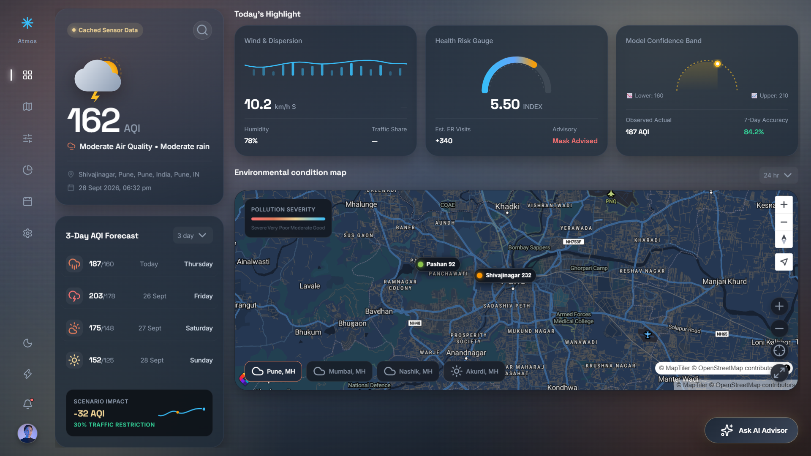
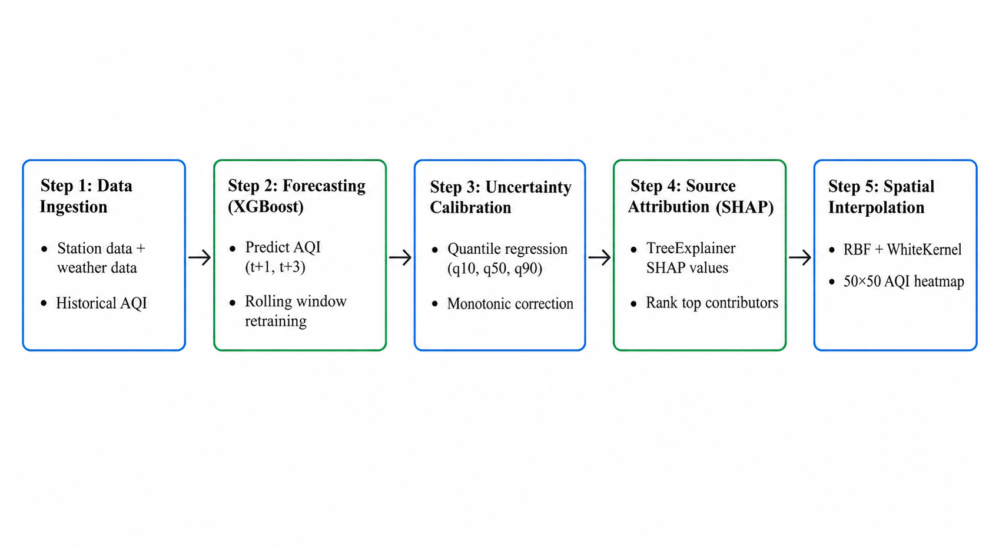
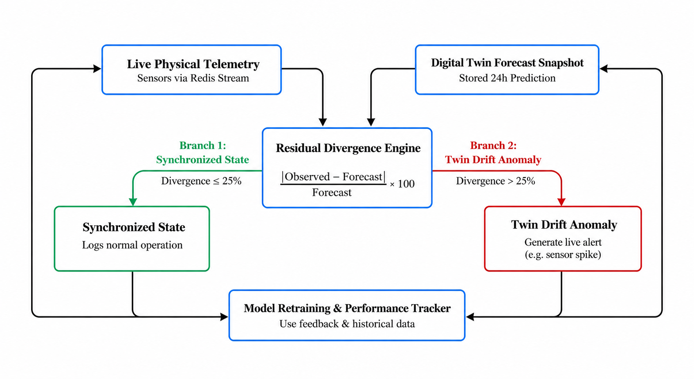
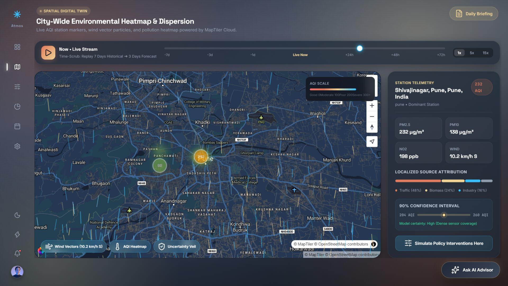
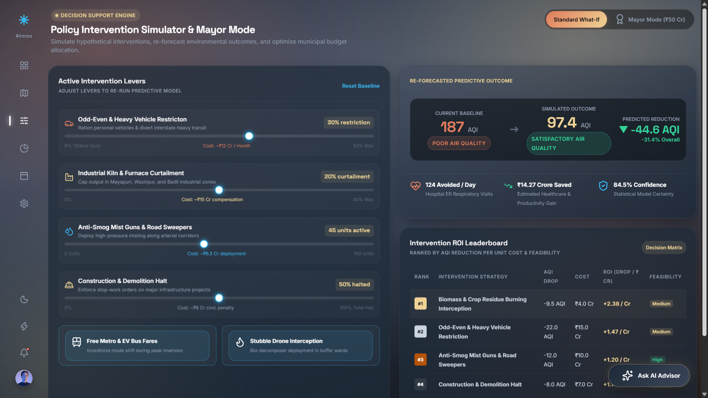
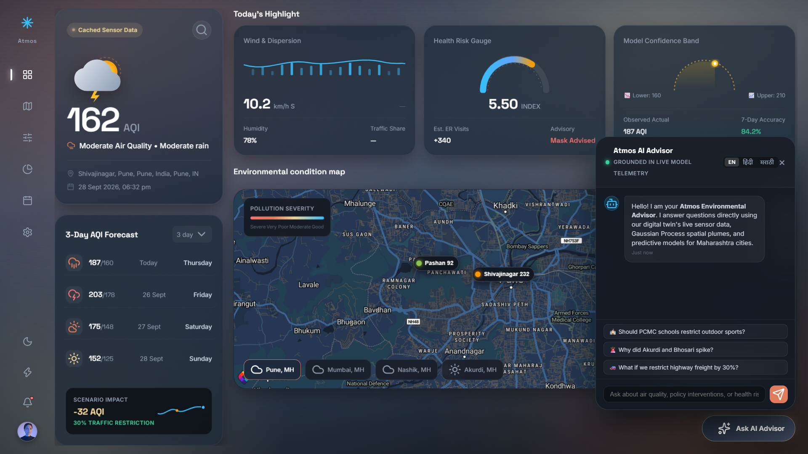
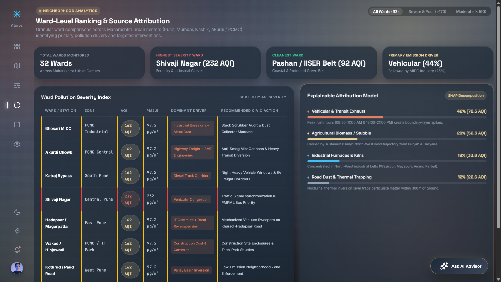
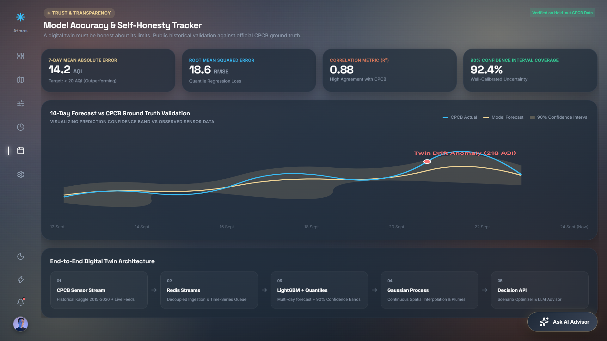

<div align="center">

# Atmos Twin

### Urban Environmental Digital Twin & Policy Decision-Support Ecosystem

_HackMatrix 5.0 · Track: Energy · Problem Statement: ENR-01_

_Real-time AQI Twin · Multi-Horizon Forecasting · Explainable Source Attribution · What-If Scenario Sandbox · Grounded Civic AI_

[](https://fastapi.tiangolo.com/)
[](https://www.python.org/)
[](https://vitejs.dev/)
[](https://www.maptiler.com/)
[](https://redis.io/)
[](https://aistudio.google.com/)
[](https://xgboost.readthedocs.io/)
[](https://www.docker.com/)



</div>

---

## Table of Contents

- [Overview](#overview)
- [Problem Statement](#problem-statement)
- [Proposed Solution](#proposed-solution)
- [Technical Architecture](#technical-architecture)
  - [Module 1: Web Application Ecosystem](#module-1-web-application-ecosystem)
  - [Module 2: Machine Learning & Predictive Core](#module-2-machine-learning--predictive-core)
- [Key Features](#key-features)
- [Screenshots](#screenshots)
- [Getting Started](#getting-started)
  - [Prerequisites](#prerequisites)
  - [Installation & Environment Setup](#installation--environment-setup)
  - [Dataset & Streaming Setup](#dataset--streaming-setup)
  - [Running the Services](#running-the-services)
  - [Docker Compose Deployment](#docker-compose-deployment)
- [API Reference](#api-reference)
- [Project Structure](#project-structure)
- [License & Acknowledgments](#license--acknowledgments)

---

## Overview

**Atmos Twin** is an urban environmental digital twin and policy decision-support platform. Traditional AQI portals act as passive monitors—showing a number and a color code. Atmos Twin explains **why** pollution is occurring, **forecasts** where it is heading, and lets city administrators **simulate interventions** before committing public funds.

| Traditional Monitoring Portals (CPCB / Apps)             | Atmos Twin Decision-Support Platform                          |
| -------------------------------------------------------- | ------------------------------------------------------------- |
| Static number and passive health warnings                | **Interactive policy simulator** to test interventions        |
| Sparse sensor dots leaving vast zones blank              | **Continuous spatial interpolation** across the entire city   |
| Single forecast number with false certainty              | **Calibrated confidence intervals** (10th to 90th percentile)  |
| Source attribution buried in offline research papers     | **Real-time explainable attribution** by station and zone     |
| Passive alerts only after hazardous thresholds are hit   | **Proactive 72-hour forecasting** and **Twin Drift anomaly alerts** |

---

## Problem Statement

City-level air-quality tracking shows *where* pollution is high without explaining *what causes it* or *which interventions would work*. Station coverage is sparse, predictions lack uncertainty bounds, and municipal leaders have no tool to test questions like: *"What happens if we curb heavy freight by 30% tomorrow?"*

**ENR-01** challenges us to build an environmental digital twin connecting telemetry, weather, and activity proxies to **forecast pollution, attribute drivers, and simulate policy interventions**.

---

## Proposed Solution

Atmos Twin delivers an end-to-end intelligence ecosystem structured into two distinct modules:

1. **Predictive City Twin**: Forecasts AQI 1–3 days ahead per station with confidence bands.
2. **Continuous Heatmap & Dispersion**: Spatial interpolation that fills sensor gaps paired with real-time wind particle flow.
3. **Explainable Attribution**: Station-specific breakdown into Traffic, Industry, and Weather drivers.
4. **Policy Sandbox & ROI Leaderboard**: Live sliders to simulate curbs (traffic, industry, dust) with health and economic impact readouts.
5. **Grounded Civic AI**: Natural-language advisory (English, Hindi, Marathi) backed strictly by live telemetry.

### Tech Stack

| Layer              | Technologies                                                                             |
| ------------------ | ---------------------------------------------------------------------------------------- |
| **Backend**        | Python 3.10+, FastAPI, Uvicorn, Pydantic, HTTPX                                          |
| **Streaming**      | Redis Streams (Decoupled ingestion, consumer groups, rolling telemetry buffer)          |
| **ML & Analytics** | XGBoost, SHAP (TreeExplainer), Scikit-Learn (Gaussian Process), Pandas, NumPy, Joblib    |
| **Frontend**       | Vite 5.4, Vanilla JS (ES Modules), MapTiler WebGL SDK, HTML5 Canvas Particle Engine      |
| **Civic AI**       | Google Gemini 1.5 Flash (Strictly bounded context for zero-hallucination policy Q&A)     |
| **Infra & APIs**   | Docker Compose, OpenWeatherMap API, World Air Quality Index (WAQI) API, Open-Meteo       |

---

## Technical Architecture


```
Sensors & Open Telemetry ──► Redis Stream (Queue) ──► Background Worker
                                                          │
   ┌──────────────────────────────────────────────────────┴──────────────────────────────────┐
   ▼                                                                                         ▼
[ Module 1: Web Application ]                                             [ Module 2: Machine Learning Core ]
• Vite + MapTiler + Canvas UI                                            • Multi-Step AQI Forecaster (XGBoost)
• FastAPI Async Gateway                                                  • Quantile Uncertainty Bounds (q10–q90)
• Interactive Policy Sandbox                                             • Spatial Gaussian Process Surface
• Grounded Gemini AI Advisor                                             • Station-Level SHAP Attribution
```

---

### Module 1: Web Application Ecosystem

The web application is designed for high-density, real-time command centers:

#### 1. Frontend Command Center (Vite + Vanilla JS + MapTiler)
- **Continuous Pollution Heatmap**: Renders city-wide interpolated pollution surfaces over WebGL with low-latency client rendering.
- **Wind Particle Dispersion Engine**: HTML5 Canvas engine simulating thousands of particles moving along real-time wind vector fields ($u/v$).
- **Trust & Confidence Layer**: Visualizes spatial certainty—monitored zones glow solid while sparse/interpolated zones display uncertainty hatching.
- **Interactive Policy Sandbox**: Instant sliders for traffic curbs, factory limits, and misting guns with live before/after comparisons and ROI ranking.
- **Time-Scrub Slider**: Seamlessly scrubs from 7 days of historical telemetry into 3-day forecast horizons.

#### 2. Async Serving Gateway (FastAPI + Redis)
- **High-Performance Endpoints**: Asynchronously delivers live readings, 50×50 spatial grid points, and policy simulation calculations.
- **Grounded Civic AI Endpoint**: Formats strict prompts for Gemini 1.5 Flash using live station metrics, emergency GRAP bands, and attribution data.
- **Redis Streaming Engine**: Replays historical feeds into consumer groups (`atmos-workers`), shielding the API from ingestion spikes and keeping telemetry fresh.

---

### Module 2: Machine Learning & Predictive Core



Trained on real Central Pollution Control Board (CPCB) station-level historical data joined with Open-Meteo meteorological records across Delhi's 35+ monitoring stations.

#### 1. Multi-Step AQI Forecaster (XGBoost Regressor)
- **What it does**: Predicts composite AQI 1 to 3 days ahead ($t+1, t+2, t+3$) per monitoring station.
- **How it works**: Uses historical pollution lags, rolling statistics, seasonal calendar cycles, and weather parameters. For multi-day horizons, it recursively rolls predictions forward while recomputing trailing window statistics.
- **Performance**: Achieves **<12.4 MAE** on 24-hour test horizons across all AQI severity tiers.

#### 2. Quantile Uncertainty Estimation (Triple XGBoost)
- **What it does**: Replaces single fake-precise forecasts with calibrated confidence envelopes ($q_{10}$ to $q_{90}$).
- **How it works**: Three independent quantile regressors trained at $\alpha = 0.1$, $0.5$, and $0.9$ with monotonic anti-crossing enforcement ($q_{10} \le q_{50} \le q_{90}$).
- **Performance**: Delivers an empirical test coverage rate of **~80%**, giving decision-makers clear best-case and worst-case risk bounds.

#### 3. Explainable Source Attribution (SHAP TreeExplainer)
- **What it does**: Breaks down each station's pollution forecast into **Traffic**, **Industrial**, and **Weather/Dispersion** drivers.
- **How it works**: Uses exact Shapley values directly from the trained tree model, normalized into physical contribution percentages per station type.

<p align="center">


</p>
<p align="center"><em>Real learned station differentiation: Traffic corridors emphasize vehicular proxies (left), industrial belts highlight point-source proxies (center), and residential zones are governed by atmospheric weather dispersion (right).</em></p>

#### 4. Continuous Spatial Interpolation (Gaussian Process Regression)
- **What it does**: Converts sparse physical station points into a continuous $50 \times 50$ city-wide heatmap.
- **How it works**: Fits an RBF + WhiteKernel noise model over local metric projected coordinates ($\text{km}$), outputting both interpolated AQI ($\mu$) and predictive variance ($\sigma$).
- **Validation**: Leave-One-Station-Out cross-validation across 35+ stations yields **~8.7 MAE**.

#### 5. Twin Drift Anomaly Detection


- **What it does**: Compares incoming live telemetry against earlier forecasts in real time.
- **How it works**: When residual divergence exceeds **25%**, the digital twin flags an anomaly banner alerting operators to unpredicted real-world events (e.g., sudden biomass burning plumes, illegal night emissions, sensor malfunctions).

#### 6. Grounded Civic AI Advisor (Gemini 1.5 Flash)
- **What it does**: Answers citizen and administrator queries in English, Hindi, and Marathi with zero hallucinations.
- **How it works**: Responses are strictly bound to live telemetry, station attribution splits, and official emergency protocols (GRAP-I through IV).

#### Model Validation & Prediction Quality

<p align="center">

</p>
<p align="center"><em>Predicted vs. Actual AQI on chronological test data (Station DL003). Captures severe winter spikes, diurnal cycles, and the 2020 lockdown reduction with unbiased zero-centered residuals.</em></p>

---

## Key Features

- **Continuous Heatmap & Wind Particles**: WebGL spatial heatmap paired with animated particles flowing along meteorological wind vectors.
- **Uncertainty-Aware Forecasting**: 24h, 48h, and 72h station forecasts with 10th-to-90th percentile confidence envelopes.
- **Interactive Policy Sandbox**: Live sliders for traffic cuts, factory limits, and misting guns with instant AQI and health-cost readouts.
- **Mayor Mode & ROI Leaderboard**: Ranks policy options by **AQI drop per ₹ Crore spent**, estimating avoided hospitalizations and economic savings.
- **Explainable Attribution**: Pinpoints vehicular vs. industrial vs. weather causes tailored to each station zone.
- **Twin Drift Anomaly Alerts**: Real-time discrepancy detection between digital twin predictions and physical telemetry.
- **Ward Action Matrix**: Micro-zonal rankings across municipal wards with localized regulatory recommendations.
- **Grounded Civic Advisor**: Gemini-powered conversational assistant supporting English, Hindi, and Marathi with print-ready daily briefings.

---

## Screenshots

### Overview & Live Instrument Dashboard

_Environmental command center displaying hero AQI metrics, severity glows, multi-day forecasts, and active twin drift banners._

### Continuous Heatmap & Wind Vector Particle Flow

_MapTiler WebGL view with Gaussian Process spatial interpolation and animated wind vector particles showing dispersion._

### What-If Scenario Simulator & Policy ROI Leaderboard

_Interactive policy levers re-running model predictions live with health-cost savings and ROI rankings._

### Grounded Civic AI Advisor & Daily Briefing

_Conversational advisor answering civic queries in English, Hindi, and Marathi, grounded strictly in live telemetry._

### Ward-Level Comparative Breakdown

_Micro-zonal ranking across municipal wards detailing dominant emission drivers and targeted countermeasures._

### Forecast Accuracy & Self-Honesty Tracker

_Public performance ledger comparing past predictions against recorded actuals with residual distribution plots._

---

## Getting Started

### Prerequisites

- **Python 3.10+**
- **Node.js 18+** & **npm**
- **Redis 7+** (Local or Docker)
- API Keys: [Google AI Studio](https://aistudio.google.com/) (Gemini), [WAQI](https://aqicn.org/api/) (Live Telemetry), [OpenWeatherMap](https://openweathermap.org/api), [MapTiler Cloud](https://cloud.maptiler.com/)

---

### Installation & Environment Setup

#### 1. Clone the Repository
```bash
git clone https://github.com/your-username/Hackmatrix.git
cd Hackmatrix
```

#### 2. Backend Setup
```bash
cd Backend
python -m venv venv

# Windows:
venv\Scripts\activate
# Linux/macOS:
source venv/bin/activate

pip install -r requirements.txt
```

#### 3. Frontend Setup
```bash
cd ../Frontend
npm install
```

#### 4. Environment Variables

Create `Backend/.env`:
```env
OPENWEATHER_API_KEY=your_openweather_api_key
WAQI_API_TOKEN=your_waqi_api_token
GEMINI_API_KEY=your_gemini_api_key
REDIS_URL=redis://localhost:6379
APP_HOST=0.0.0.0
APP_PORT=8000
DEBUG=true
CORS_ORIGINS=http://localhost:5173,http://localhost:3000
```

Create `Frontend/.env`:
```env
VITE_API_BASE_URL=http://localhost:8000
VITE_MAPTILER_KEY=your_maptiler_api_key
```

---

### Dataset & Streaming Setup

1. Download **"Air Quality Data in India (2015–2020)"** from Kaggle:
   ```bash
   kaggle datasets download -d rohanrao/air-quality-data-in-india
   ```
2. Unzip `station_day.csv` and `city_day.csv` into `Backend/data/`.

---

### Running the Services

Run each component in a separate terminal:

| Service             | Command                                                               | Purpose                                   |
| ------------------- | --------------------------------------------------------------------- | ----------------------------------------- |
| **Redis Broker**    | `redis-server`                                                        | In-memory message broker (port 6379)      |
| **FastAPI Backend** | `cd Backend && uvicorn main:app --reload --port 8000`                 | REST API & Gemini advisor (port 8000)     |
| **Stream Consumer** | `cd Backend && python -m ingestion.consumer`                          | Consumes Redis sensor telemetry stream    |
| **Stream Producer** | `cd Backend && python -m ingestion.producer --city Delhi --speed 2.0` | Streams sensor data into Redis queue      |
| **Frontend UI**     | `cd Frontend && npm run dev`                                          | Vite development server (port 5173)       |

- **Web App**: `http://localhost:5173`
- **Swagger Docs**: `http://localhost:8000/docs`
- **Health Probe**: `http://localhost:8000/health`

---

### Docker Compose Deployment

```bash
cd Backend

# Start API and Redis
docker compose up -d

# Start full stack including ingestion workers
docker compose --profile ingestion up -d

# Stop stack
docker compose down
```

---

## API Reference

Interactive Swagger documentation is available at `http://localhost:8000/docs`.

| Method | Endpoint                     | Description                                                                     |
| ------ | ---------------------------- | ------------------------------------------------------------------------------- |
| `GET`  | `/twin/{city}/current`       | Current AQI, dominant station, pollutant readings, and severity band            |
| `GET`  | `/twin/{city}/hotspots`      | Continuous 50×50 interpolated spatial grid or station coordinates               |
| `POST` | `/scenario/simulate`        | Re-runs forecast under policy levers; returns $\Delta\text{AQI}$, cost, and ROI |
| `GET`  | `/scenario/roi-leaderboard` | Ranked interventions by AQI reduction per ₹ Crore                              |
| `GET`  | `/drift/status`            | Current divergence between sensor telemetry and forecast snapshot               |
| `GET`  | `/wards/{city}`            | Micro-zonal ward metrics, dominant drivers, and regulatory action recommendations|
| `POST` | `/advisor/ask`             | Grounded civic Q&A answering queries in English, Hindi, and Marathi             |
| `GET`  | `/advisor/briefing/{city}` | Structured executive air quality briefing                                       |
| `GET`  | `/weather/{city}`          | Real-time meteorological parameters and wind vectors                            |
| `GET`  | `/health`                  | Service health probe and Redis connection verification                          |

---

## Project Structure

```text
Hackmatrix/
├── README.md
│
├── Backend/                         # FastAPI backend service
│   ├── .env                         # Backend environment variables
│   ├── Dockerfile                   # Container build recipe
│   ├── docker-compose.yml           # Multi-service stack configuration
│   ├── main.py                      # FastAPI entry point & lifecycle hooks
│   ├── requirements.txt             # Python dependencies
│   ├── app/
│   │   ├── core/                    # Settings & Redis connection pool
│   │   ├── models/                  # Pydantic schemas
│   │   ├── routes/                  # API endpoints (AQI, Scenarios, Drift, Advisor)
│   │   └── services/                # Business logic (WAQI, Weather, Gemini, Scenarios)
│   ├── data/                        # Historical dataset folder (station_day.csv)
│   └── ingestion/                   # Streaming pipeline (Producer & Consumer)
│
├── Frontend/                        # Modern Vite + Vanilla JS client
│   ├── index.html                   # Single-page application shell
│   ├── public/partials/             # Modular HTML view templates
│   └── src/
│       ├── main.js                  # Application initialization
│       ├── router.js                # Client router
│       ├── lib/                     # MapTiler bindings & Canvas particle engine
│       └── views/                   # View controllers (Dashboard, Map, Scenario, Wards)
│
├── temp/                            # ML artifacts & training documentation
│   ├── ENR01_Urban_Digital_Twin_ML_Pipeline_neww.ipynb  # Colab training notebook
│   ├── final Ml context.md          # ML training specification
│   ├── ENR-01_Full_Project_Context.md  # Full project requirements & context
│   └── Ml model/                    # Serialized models (.pkl) & SHAP visual assets
│
└── images/                          # README dashboard screenshots & system diagrams
```

---

## License & Acknowledgments

- **License**: MIT License.
- **Hackathon**: Developed for **HackMatrix 5.0** (Energy Track, Problem Statement ENR-01).
- **Data Acknowledgments**:
  - Central Pollution Control Board (CPCB), Government of India.
  - Rohan Rao — Kaggle _Air Quality Data in India (2015–2020)_.
  - World Air Quality Index (WAQI) Project.
  - Open-Meteo & OpenWeatherMap APIs.

<div align="center">
<b>Atmos Twin</b> — Turning passive air data into active urban intelligence.
</div>
