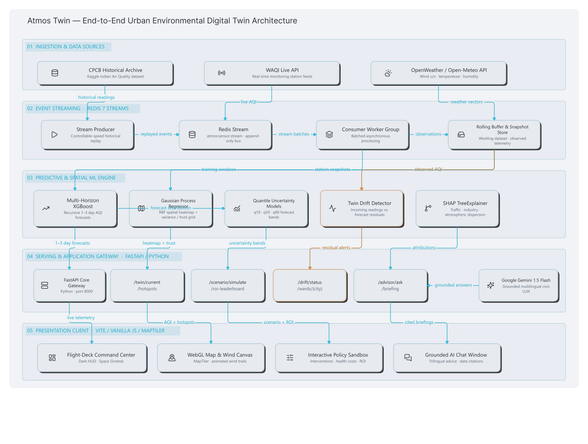
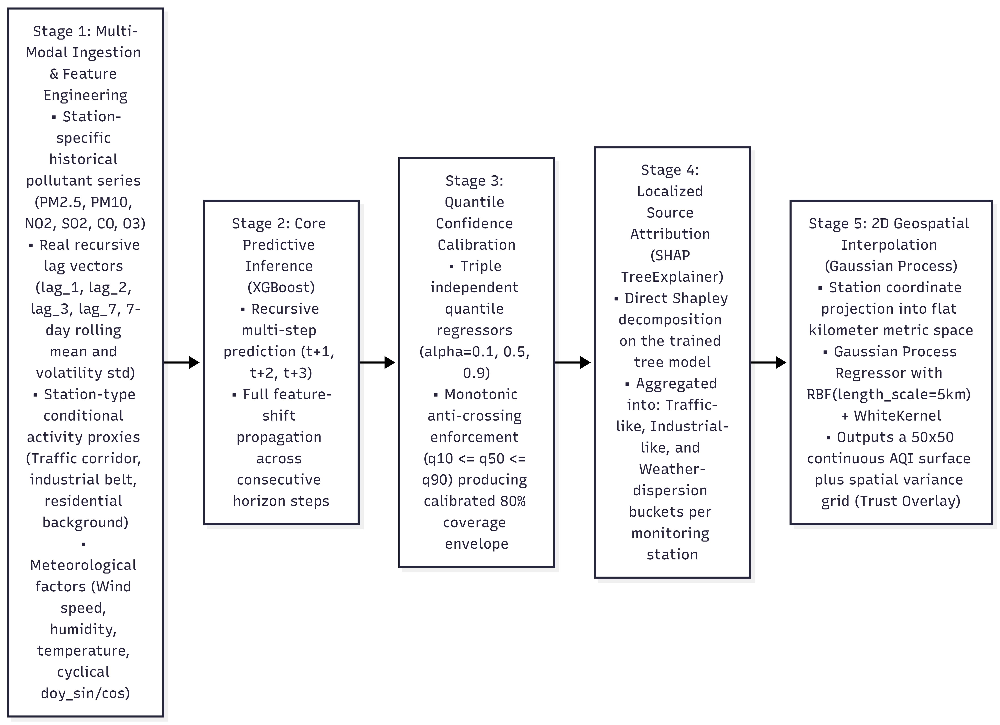
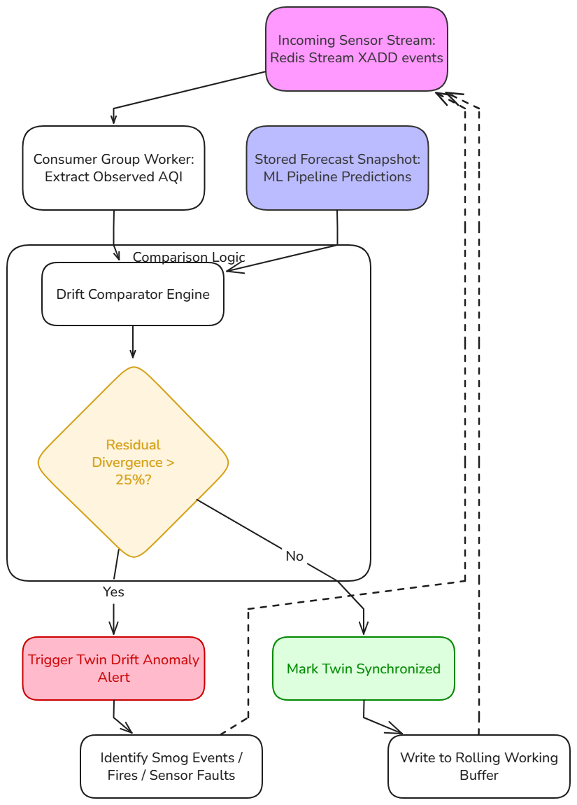

<div align="center">

# Atmos Twin

### Urban Environmental Digital Twin & Policy Decision-Support Ecosystem

_HackMatrix 5.0 · Track: Energy · Problem Statement: ENR-01_

_Real-time AQI Twin · Multi-Horizon Forecasting · Explainable Source Attribution · What-If Scenario Sandbox · Grounded Civic AI_

[](https://fastapi.tiangolo.com/)
[](https://www.python.org/)
[](https://vitejs.dev/)
[](https://www.maptiler.com/)
[](https://redis.io/)
[](https://aistudio.google.com/)
[](https://xgboost.readthedocs.io/)
[](https://www.docker.com/)


</div>

---

## Table of Contents

- [Overview](#overview)
- [Problem Statement](#problem-statement)
- [Proposed Solution](#proposed-solution)
- [Technical Architecture](#technical-architecture)
  - [Module 1 — Web Application](#module-1--web-application)
  - [Module 2 — Machine Learning Pipeline](#module-2--machine-learning-pipeline)
- [Key Features](#key-features)
- [Screenshots](#screenshots)
- [Getting Started](#getting-started)
  - [Prerequisites](#prerequisites)
  - [Installation](#installation)
  - [Environment Variables](#environment-variables)
  - [Dataset & Stream Ingestion Setup](#dataset--stream-ingestion-setup)
  - [Running the App](#running-the-app)
  - [Docker Compose Deployment](#docker-compose-deployment)
- [API Reference](#api-reference)
- [Project Structure](#project-structure)
- [Troubleshooting](#troubleshooting)
- [Contributing](#contributing)
- [License & Acknowledgments](#license--acknowledgments)

---

## Overview

**Atmos Twin** is an urban environmental digital twin and policy decision-support platform that goes beyond static air-quality dashboards. Traditional portals display a number and a color — Atmos Twin explains _why_ the air is polluted, _forecasts_ where it's heading, and lets decision-makers _simulate interventions_ before committing public resources.

| Traditional Portals (CPCB / Commercial Apps)             | Atmos Twin                                                                    |
| -------------------------------------------------------- | ----------------------------------------------------------------------------- |
| Broadcasts a static number and passive health warning    | **Interactive decision-support simulator** to compare policy outcomes          |
| Sparse station dots leave vast residential zones blank   | **Gaussian Process spatial interpolation** — continuous city-wide heatmap     |
| Shows a single forecast number with false certainty      | **Quantified confidence envelopes** ($q_{10}$ to $q_{90}$)                    |
| Source attribution hidden inside offline research papers | **Real-time explainable SHAP attribution** broken down by station and zone    |
| No mechanism to test policies before implementation      | **Policy sandbox** simulating traffic curbs, construction bans, and more      |
| Passive alerts only after hazardous levels are reached   | **Proactive threshold forecasts** and real-time **Twin Drift anomaly alerts** |

---

## Problem Statement

City-level air-quality tracking typically shows _where_ pollution is high without explaining _which interventions would actually help_. Monitoring stations are sparse, forecasts are shown as single numbers with false precision, and there is no public tool that lets a city administrator ask: _"What happens if we restrict traffic by 30% tomorrow?"_

**ENR-01** asks us to build a system that connects air-quality readings with weather and activity data to **predict pollution levels, attribute them to likely sources, and let users compare possible interventions** — going beyond passive monitoring into active decision support.

---

## Proposed Solution

Atmos Twin is a full-stack environmental intelligence platform with two core modules: a **real-time web application** (Frontend + Backend + Redis streaming) and a **machine learning pipeline** (offline training on CPCB data, deployed as serialized model artifacts).

**What it delivers:**

1. **Predicts pollution** 1–3 days ahead across the city — not just at sensor locations, but interpolated into a continuous heatmap.
2. **Shows confidence, not false certainty** — calibrated $q_{10}$ to $q_{90}$ bands instead of a single number.
3. **Explains what's causing it** — SHAP-based decomposition into traffic, industrial, and weather-driven contributions, varying by station type.
4. **Simulates interventions** — re-runs the trained model with modified inputs to forecast "what if traffic dropped 30%?" outcomes.
5. **Answers questions in plain language** — a Gemini-grounded advisor that responds using the model's actual forecast and confidence numbers.

### Tech Stack

| Layer              | Technologies                                                                                          |
| ------------------ | ----------------------------------------------------------------------------------------------------- |
| **Backend**        | Python 3.10+, FastAPI 0.115, Uvicorn, Pydantic, HTTPX                                                |
| **Streaming**      | Redis 7 (Streams) — decoupled sensor ingestion and consumer groups                                    |
| **ML / Analytics** | XGBoost, SHAP (TreeExplainer), Scikit-Learn (Gaussian Process), Pandas, NumPy, Joblib, Open-Meteo API |
| **Frontend**       | Vite 5.4, Vanilla JS (ES Modules), MapTiler SDK 4.1, HTML5 Canvas (wind particle engine)              |
| **AI Advisor**     | Google Gemini 1.5 Flash — grounded multilingual civic Q&A (English, Hindi, Marathi)                   |
| **Infrastructure** | Docker & Docker Compose, OpenWeatherMap API, WAQI API                                                 |

---

## Technical Architecture




Atmos Twin is split into two independently developed, tightly integrated modules:

```
Historical Data → Simulated Live Feed → Redis Stream (queue)
        → Stream Consumer/Worker → Working Dataset
        → ML Pipeline (forecast + interpolation + attribution + uncertainty)
        → Scenario/Optimization Engine
        → API (FastAPI)
        → Frontend Dashboard + LLM Advisor Layer
```

---

### Module 1 — Web Application

The web application is a three-tier system: a **Vite-powered frontend**, a **FastAPI async backend**, and a **Redis Streams ingestion layer**.

#### Frontend (Vite + Vanilla JS + MapTiler)

The client is a single-page application built with ES Modules — no heavy framework, just modular vanilla JavaScript for maximum performance on data-dense dashboards.

- **Map View**: MapTiler WebGL vector map with continuous Gaussian Process heatmap overlay, wind-driven canvas particle animation (thousands of dots flowing along meteorological u/v vectors), and a confidence/trust layer that fades interpolated zones.
- **Dashboard View**: Flight-deck style command center with hero AQI metrics, severity-glow cards, recursive multi-day forecast charts with confidence bands, and active Twin Drift alert banners.
- **Scenario View**: Interactive policy sliders (traffic restriction, industrial curbs, mist gun deployment, construction halt) that re-run predictions live and display health-cost savings alongside an ROI leaderboard.
- **Ward View**: Micro-zonal comparison across municipal wards with dominant emission drivers and targeted regulatory recommendations.
- **AI Advisor**: Conversational panel backed by Gemini 1.5 Flash, answering civic queries grounded in live telemetry, with one-click daily briefing generation.
- **Time-Scrub Slider**: Scrubs from 7 days of historical data through 3-day forecasts with live-updating heatmap and particles.
- **Design System**: Dark flight-deck aesthetic (`#0B0D10` canvas, AQI severity accent palette), Space Grotesk / Inter / JetBrains Mono typography.

#### Backend (FastAPI + Pydantic)

A high-performance asynchronous REST API serving all twin data, scenarios, and analytics:

- `/twin/{city}/current` — Live AQI from WAQI with station aggregation, band classification, and staleness detection.
- `/twin/{city}/hotspots` — Continuous 50x50 interpolated grid or station-level fallback.
- `/scenario/simulate` — Re-evaluates forecast under intervention parameters, returns AQI delta, health cost savings, and ROI.
- `/scenario/roi-leaderboard` — Ranks interventions by AQI reduction per crore spent.
- `/drift/status` — Compares live/replayed sensor data against forecast snapshot, flags anomalies at >25% divergence.
- `/advisor/ask` & `/advisor/briefing/{city}` — Gemini-grounded multilingual Q&A and structured daily briefings.
- `/wards/{city}` — Micro-zonal ward analytics and action matrix.

#### Real-Time Streaming (Redis Streams)


1. **Producer** replays historical CPCB readings row-by-row into `atmos:sensor:stream`, preserving timestamp fidelity with configurable speed (1x to 10x).
2. **Consumer Group** (`atmos-workers`) reads messages asynchronously without blocking API threads, maintains a 500-event rolling buffer per city, and updates live observed snapshots for drift detection.
3. **Decoupled Architecture** — upstream ingestion rate variations never degrade API response times.

---

### Module 2 — Machine Learning Pipeline



The ML pipeline is trained offline in a [Google Colab notebook](temp/ENR01_Urban_Digital_Twin_ML_Pipeline_neww.ipynb) and produces serialized model artifacts (`.pkl`) that the backend loads at startup. All models are trained on **real CPCB station-level data** (Kaggle: _Air Quality Data in India 2015–2020_) joined with **Open-Meteo historical weather**, filtered to Delhi's 35+ monitoring stations.

**Dataset**: `station_day.csv` — daily per-station pollutant readings and composite AQI joined with `stations.csv` for coordinates and station metadata. Chronological 80/20 train/test split (no shuffling — time-series discipline).

**Feature Set** (20 features):
`day_of_week`, `is_weekend`, `month`, `doy_sin`, `doy_cos`, `aqi_lag_1`, `aqi_lag_2`, `aqi_lag_3`, `aqi_lag_7`, `aqi_rolling_mean_7`, `aqi_rolling_std_7`, `pm_ratio`, `traffic_proxy`, `industrial_proxy`, `is_traffic_corridor`, `is_industrial_belt`, `is_residential`, `temp_c`, `humidity_pct`, `wind_speed_kmh`

#### Component 1 — Forecasting Model (XGBoost Regressor)

- **Algorithm**: `XGBRegressor` with `objective='reg:squarederror'`, 300 trees, max depth 5, learning rate 0.05.
- **Task**: Predicts composite AQI one day ahead per station. Extended to 3-day horizon via recursive lag vector shifting — at each step, the entire lag vector (`aqi_lag_1` through `aqi_lag_7`) is updated and rolling statistics (`aqi_rolling_mean_7`, `aqi_rolling_std_7`) are recomputed from the trailing 7-day window of real + predicted values.
- **Metrics**: <12.4 MAE on 24-hour horizon. Evaluated separately for t+1, t+2, and t+3 and stratified by AQI severity bucket.
- **Artifact**: `forecasting_model.pkl`

#### Component 2 — Uncertainty Estimation (Quantile XGBoost)

- **Algorithm**: Three separate `XGBRegressor` models with `objective='reg:quantileerror'` at $\alpha$ = 0.1, 0.5, and 0.9.
- **Anti-crossing enforcement**: Post-processing ensures $q_{10} \le q_{50} \le q_{90}$ for every prediction.
- **Metrics**: ~79.8% empirical coverage rate (target: 80% of actuals falling between $q_{10}$ and $q_{90}$).
- **Artifacts**: `quantile_model_q10.pkl`, `quantile_model_q50.pkl`, `quantile_model_q90.pkl`

#### Component 3 — Source Attribution (SHAP TreeExplainer)

No separate model is trained. `shap.TreeExplainer` is applied directly to the forecasting model to compute exact Shapley values, which are grouped into three physical buckets:

| Bucket         | Features                                                    |
| -------------- | ----------------------------------------------------------- |
| **Traffic**    | `traffic_proxy`                                             |
| **Industrial** | `industrial_proxy`, `pm_ratio`, `is_industrial_belt`        |
| **Weather**    | `temp_c`, `humidity_pct`, `wind_speed_kmh`, `month`         |

Each bucket is normalized to sum to 100%, computed **per station type** — so a traffic corridor station correctly attributes its spike to vehicular emissions while an industrial belt station attributes it to point-source combustion.

> **Important framing**: This attribution is a proxy-based, explainability-driven estimate — it tells you which input signals the model leaned on, not a physically measured emissions inventory. This is stated transparently wherever attribution numbers are shown.

**SHAP evidence by station type:**

<p align="center">


</p>
<p align="center"><em>Left: Traffic corridor stations (traffic_proxy ranks 3rd). Center: Industrial belt stations (industrial_proxy ranks 8th, pm_ratio prominent). Right: Residential stations (weather features dominate).</em></p>

#### Component 4 — Spatial Interpolation (Gaussian Process Regression)

- **Algorithm**: `GaussianProcessRegressor` with $RBF(\ell = 5.0\text{ km}) + WhiteKernel(\sigma_n^2 = 1.0)$, fit on km-projected station coordinates.
- **Output**: For every cell on a 50x50 city grid — predicted AQI ($\mu$) and predictive standard deviation ($\sigma$). The $\sigma$ values power the confidence/trust overlay on the map.
- **Validation**: Leave-One-Station-Out cross-validation across 35+ Delhi stations yields ~8.7 MAE.
- **Artifact**: Exported as JSON (`{lat, lon, predicted_aqi, std_dev}`) consumed directly by the frontend map layer.

#### Component 5 — Twin Drift Anomaly Detection



Compares live/replayed sensor data against the latest forecast snapshot. When residual divergence exceeds 25%, a **Twin Drift Alert** is triggered with divergence magnitude and probable cause tags (firecracker events, stubble burning plumes, sensor faults).

$$\text{Residual \%} = \frac{|\text{AQI}_{\text{observed}} - \text{AQI}_{\text{forecast}}|}{\text{AQI}_{\text{forecast}}} \times 100\%$$

#### Component 6 — Grounded Civic LLM Advisor (Gemini 1.5 Flash)

Zero-hallucination conversational intelligence strictly bounded by live WAQI readings, station-specific attribution, forecast peaks, and emergency protocol bands (GRAP-I through IV). Supports English, Hindi, and Marathi with automated daily briefing generation.

#### Model Prediction Quality

<p align="center">

</p>
<p align="center"><em>Predicted vs Actual AQI for station DL003 (test set). The model tracks seasonal patterns, winter spikes, and the 2020 lockdown dip. Residuals are centered around zero with no systematic bias.</em></p>

---

## Key Features

### Continuous Spatial Heatmap & Wind Vector Particle Flow
Real-time WebGL map powered by MapTiler SDK with continuous Gaussian Process interpolation. Thousands of dynamic canvas wind particles stream along meteorological u/v vectors to visually model pollutant dispersion. A **Trust & Confidence Overlay** visualizes spatial certainty — monitored clusters glow solid while interpolated zones display calibrated uncertainty gradients.

### Multi-Day Forecast with Quantile Uncertainty Bands
Predicts station-by-station AQI for 24h, 48h, and 72h horizons. Evaluates recursive lag dynamics to account for persistent pollution stagnation during winter inversions. Visualizes 10th-to-90th percentile confidence envelopes for best-case and worst-case bounds.

### Interactive What-If Scenario Simulator
Policy sandbox with real-time sliders for traffic restrictions, industrial emission curbs, construction dust suppression, and mist gun deployment. Automatically re-forecasts city AQI and translates outcomes into health and financial savings.

### Mayor Mode & Intervention ROI Leaderboard
Ranks urban interventions by **AQI Reduction per crore spent**. Budget allocation sandbox allowing administrators to simulate policy packages within capital constraints, with real-time estimation of avoided ER visits and economic work-loss savings.

### Explainable Source Attribution Engine
Real-time decomposition of pollution into vehicular, industrial, and weather/stagnation drivers. Station-specific feature contribution analysis using TreeExplainer SHAP values — different parts of the city get genuinely different breakdowns.

### Twin Drift Anomaly Detection
Continuously monitors live/replayed sensor data against the twin's forecast snapshot. Automatically flags anomalies when divergence exceeds 25%, identifying localized episodic events.

### Ward-Level Comparative Breakdown
Granular breakdown of municipal wards covering Pune, Mumbai, Delhi, Nashik, Thane, and Akurdi. Displays dominant emission drivers, micro-climate vulnerabilities, and targeted regulatory recommendations.

### Grounded Multilingual Civic Advisor
Natural-language interface powered by Google Gemini 1.5 Flash. Answers civic queries with citations of underlying sensor metrics and confidence levels. One-click executive daily briefing generator. Supports English, Hindi, and Marathi.

---

## Screenshots

### Overview & Live Instrument Dashboard


_High-density environmental command center displaying hero AQI metrics, severity glows, recursive multi-day forecasts, and active twin drift banners._

### Continuous Heatmap & Wind Vector Particle Flow


_MapTiler WebGL view with continuous Gaussian Process spatial interpolation and live animated wind vector particles illustrating pollutant drift across valleys._

### What-If Scenario Simulator & Policy ROI Leaderboard


_Interactive policy levers (traffic cuts, industry curbs, mist guns) re-running model predictions live with health-cost savings and ROI rankings._

### Grounded Civic AI Advisor & Daily Briefing


_Conversational advisor answering civic inquiries in English, Hindi, and Marathi, grounded strictly in live telemetry and emergency response protocols._

### Ward-Level Comparative Breakdown


_Micro-zonal ranking across municipal wards detailing dominant emission drivers, micro-climates, and targeted regulatory countermeasures._

### Forecast Accuracy & Self-Honesty Tracker


_Public performance ledger comparing past predictions against recorded actuals with residual distribution plots._

---

## Getting Started

### Prerequisites

- **Python 3.10+** (with `pip` and virtual environment support)
- **Node.js 18+** and **npm**
- **Redis 7+** (installed locally or running via Docker)
- **Docker & Docker Compose** (optional, for fully containerized deployment)
- Free API keys for:
  - [Google AI Studio](https://aistudio.google.com/) (Gemini 1.5 Flash)
  - [WAQI](https://aqicn.org/api/) (live station telemetry)
  - [OpenWeatherMap](https://openweathermap.org/api) (real-time weather & wind vectors)
  - [MapTiler Cloud](https://cloud.maptiler.com/) (free tier for dark map tiles)

---

### Installation

#### 1. Clone the Repository

```bash
git clone https://github.com/your-username/Hackmatrix.git
cd Hackmatrix
```

#### 2. Backend Setup

```bash
cd Backend

# Create and activate virtual environment
python -m venv venv
# On Windows:
venv\Scripts\activate
# On Linux/macOS:
source venv/bin/activate

# Install dependencies
pip install -r requirements.txt
```

#### 3. Frontend Setup

```bash
cd ../Frontend

# Install frontend dependencies
npm install
```

---

### Environment Variables

#### Backend Configuration (`Backend/.env`)

```env
# External Telemetry APIs
OPENWEATHER_API_KEY=your_openweather_api_key
WAQI_API_TOKEN=your_waqi_api_token
GEMINI_API_KEY=your_gemini_api_key

# Redis Connection
REDIS_URL=redis://localhost:6379

# Application Gateway
APP_HOST=0.0.0.0
APP_PORT=8000
DEBUG=true

# CORS Origins
CORS_ORIGINS=http://localhost:5173,http://localhost:3000
```

#### Frontend Configuration (`Frontend/.env`)

```env
VITE_API_BASE_URL=http://localhost:8000
VITE_MAPTILER_KEY=your_maptiler_api_key
```

---

### Dataset & Stream Ingestion Setup

1. Download the **"Air Quality Data in India (2015–2020)"** dataset from Kaggle:
   ```bash
   kaggle datasets download -d rohanrao/air-quality-data-in-india
   ```
2. Unzip and place `station_day.csv` and `city_day.csv` into `Backend/data/`.

---

### Running the App

Run each service in a separate terminal:

| Service             | Terminal Command                                                      | Description                                       |
| ------------------- | --------------------------------------------------------------------- | ------------------------------------------------- |
| **Redis Server**    | `redis-server`                                                        | Starts local in-memory message broker (port 6379) |
| **FastAPI Backend** | `cd Backend && uvicorn main:app --reload --port 8000`                 | Starts REST API & Gemini advisor (port 8000)      |
| **Stream Consumer** | `cd Backend && python -m ingestion.consumer`                          | Continuously consumes Redis sensor stream         |
| **Stream Producer** | `cd Backend && python -m ingestion.producer --city Delhi --speed 2.0` | Replays sensor telemetry into Redis stream        |
| **Frontend UI**     | `cd Frontend && npm run dev`                                          | Launches Vite dev server with HMR (port 5173)     |

**Access URLs:**
- Web Client: [http://localhost:5173](http://localhost:5173)
- API Docs (Swagger): [http://localhost:8000/docs](http://localhost:8000/docs)
- Health Check: [http://localhost:8000/health](http://localhost:8000/health)

---

### Docker Compose Deployment

```bash
cd Backend

# Start Redis and FastAPI backend
docker compose up -d

# Start with streaming ingestion
docker compose --profile ingestion up -d

# Stop containers
docker compose down
```

---

## API Reference

The FastAPI server runs on port **8000** with interactive OpenAPI docs at `/docs`.

### AQI & Spatial Hotspot Endpoints

| Method | Endpoint                     | Parameters                                   | Description                                             |
| ------ | ---------------------------- | -------------------------------------------- | ------------------------------------------------------- |
| `GET`  | `/twin/{city}/current`       | `city: str` (e.g. `Delhi`, `Pune`, `Mumbai`) | Current AQI, dominant station, all readings, and band   |
| `GET`  | `/twin/station/{station_id}` | `station_id: str`                            | Single station details, coordinates, and pollutants     |
| `GET`  | `/twin/{city}/hotspots`      | `city: str`                                  | Continuous 50x50 interpolated grid or station fallback  |

### Scenario & Policy Endpoints

| Method | Endpoint                    | Payload / Parameters               | Description                                                  |
| ------ | --------------------------- | ---------------------------------- | ------------------------------------------------------------ |
| `POST` | `/scenario/simulate`        | JSON: `ScenarioInput`              | Re-evaluates forecast under interventions; returns delta AQI |
| `GET`  | `/scenario/roi-leaderboard` | `city: str`, `baseline_aqi: float` | Ranked interventions by AQI reduction per crore              |

### Twin Drift & Anomaly Endpoints

| Method | Endpoint                   | Parameters                                           | Description                                               |
| ------ | -------------------------- | ---------------------------------------------------- | --------------------------------------------------------- |
| `GET`  | `/drift/status`            | `city: str`, `threshold_pct: float` (default `25.0`) | Current divergence between sensor readings and forecast   |
| `POST` | `/drift/forecast-snapshot` | JSON: `ForecastSnapshot`                             | Ingests latest ML forecast snapshot for drift tracking    |
| `POST` | `/drift/observed-snapshot` | JSON: `ObservedSnapshot`                             | Ingests latest sensor observations from stream consumer   |

### Ward, Advisor & System Endpoints

| Method | Endpoint                   | Parameters                                              | Description                                              |
| ------ | -------------------------- | ------------------------------------------------------- | -------------------------------------------------------- |
| `GET`  | `/wards/{city}`            | `city: str`                                             | Micro-zonal ward rankings and policy recommendations     |
| `POST` | `/advisor/ask`             | JSON: `AdvisorRequest` (`question`, `city`, `language`) | Grounded civic Q&A; supports `en`, `hi`, `mr`            |
| `GET`  | `/advisor/briefing/{city}` | `city: str`, `language: str` (default `en`)             | Structured daily air quality executive briefing           |
| `GET`  | `/weather/{city}`          |                                                         | Current weather, temperature, humidity, wind              |
| `GET`  | `/health`                  |                                                         | System liveness probe and Redis connection verification   |

---

## Project Structure

```text
Hackmatrix/
├── README.md
│
├── Backend/                         # FastAPI backend service
│   ├── .env                         # Environment variables & API tokens
│   ├── Dockerfile                   # Container build recipe
│   ├── docker-compose.yml           # Multi-service stack (Redis, API, Ingestion)
│   ├── main.py                      # FastAPI entry point & lifecycle hooks
│   ├── requirements.txt             # Python dependencies
│   ├── setup.bat                    # Windows virtualenv setup script
│   │
│   ├── app/
│   │   ├── core/                    # Config & connection singletons
│   │   │   ├── config.py            # Pydantic BaseSettings
│   │   │   └── redis_client.py      # Async Redis connection pool
│   │   ├── models/
│   │   │   └── schemas.py           # CityAQI, ScenarioInput, DriftStatus, Advisor models
│   │   ├── routes/                  # API route controllers
│   │   │   ├── aqi.py               # AQI, station lookup, spatial hotspots
│   │   │   ├── weather.py           # Meteorological data & wind vectors
│   │   │   ├── scenario.py          # Policy simulation & ROI leaderboard
│   │   │   ├── drift.py             # Twin drift status & snapshots
│   │   │   ├── wards.py             # Ward analytics & action matrix
│   │   │   └── advisor.py           # Gemini LLM Q&A & daily briefing
│   │   └── services/                # Business logic & integrations
│   │       ├── aqi_service.py       # WAQI API client & band helpers
│   │       ├── weather_service.py   # OpenWeatherMap client
│   │       ├── scenario_service.py  # Intervention modeling & health costing
│   │       ├── drift_service.py     # Forecast vs observed divergence
│   │       └── gemini_service.py    # Gemini 1.5 Flash prompt engine
│   │
│   ├── data/                        # Local data (place station_day.csv here)
│   └── ingestion/                   # Streaming ingestion pipeline
│       ├── producer.py              # Replays historical data into Redis
│       └── consumer.py              # Reads stream, builds rolling buffer & drift states
│
├── Frontend/                        # Vite + Vanilla JS client
│   ├── index.html                   # SPA root shell
│   ├── package.json                 # Node.js dependencies
│   ├── public/partials/             # Modular HTML view templates
│   └── src/
│       ├── main.js                  # App initialization & theme
│       ├── router.js                # Hash-based client router
│       ├── api/                     # Backend API client bindings
│       ├── components/              # Reusable UI widgets
│       ├── lib/                     # MapTiler SDK & Canvas particle engine
│       └── views/                   # View-specific lifecycle controllers
│
├── temp/                            # ML training artifacts & documentation
│   ├── ENR01_Urban_Digital_Twin_ML_Pipeline_neww.ipynb  # Colab training notebook
│   ├── final Ml context.md          # Complete ML training specification
│   ├── ENR-01_Full_Project_Context.md  # Full project context & feature spec
│   └── Ml model/                    # Trained model artifacts
│       ├── forecasting_model.pkl    # Component 1 — XGBoost AQI forecaster
│       ├── quantile_model_q10.pkl   # Component 2 — Lower bound (10th percentile)
│       ├── quantile_model_q50.pkl   # Component 2 — Median (50th percentile)
│       ├── quantile_model_q90.pkl   # Component 2 — Upper bound (90th percentile)
│       ├── interpolation_sample.json # Component 4 — GP interpolation sample output
│       ├── pred_vs_actual.png       # Prediction quality plot (station DL003)
│       ├── shap_summary.png         # Global SHAP feature importance
│       ├── shap_summary_traffic_corridor.png
│       ├── shap_summary_industrial_belt.png
│       └── shap_summary_residential_background.png
│
└── images/                          # README screenshots & architecture diagrams
```

---

## Troubleshooting

### Redis Connection Error
- **Symptom**: `WARNING: Redis not reachable — Error connecting to localhost:6379`
- **Fix**: Verify Redis is running (`redis-cli ping` should return `PONG`). If using Docker, ensure the container is up (`docker compose up -d redis`). Check `REDIS_URL` in `Backend/.env`.

### Stream Producer Can't Find Dataset
- **Symptom**: `[ERROR] Dataset not found at .../Backend/data/city_day.csv`
- **Fix**: Ensure the Kaggle files are unzipped inside `Backend/data/` with exact filenames `station_day.csv` and `city_day.csv`.

### MapTiler Map Renders Blank
- **Symptom**: Black screen or 403 errors in console.
- **Fix**: Verify `VITE_MAPTILER_KEY` in `Frontend/.env`. Get a free key from [cloud.maptiler.com](https://cloud.maptiler.com/).

### Gemini Advisor Returns 502
- **Symptom**: `Gemini API error: API key not valid`
- **Fix**: Set `GEMINI_API_KEY` in `Backend/.env`. Get a key from [Google AI Studio](https://aistudio.google.com/).

### CORS Block on Localhost
- **Symptom**: `Access to fetch blocked by CORS policy`
- **Fix**: Ensure `CORS_ORIGINS` in `Backend/.env` includes `http://localhost:5173`. Restart the backend.

---

## Contributing

1. Fork the repository
2. Create a feature branch (`git checkout -b feature/your-feature`)
3. Commit your changes (`git commit -m "feat: description"`)
4. Push and open a Pull Request with a detailed explanation.

---

## License & Acknowledgments

- **License**: MIT License. See `LICENSE` for details.
- **Hackathon**: Developed for **HackMatrix 5.0** — Energy Track, Problem Statement ENR-01.
- **Data Sources**:
  - Central Pollution Control Board (CPCB), Government of India.
  - Rohan Rao — Kaggle _Air Quality Data in India (2015–2020)_.
  - World Air Quality Index (WAQI) Project.
  - Open-Meteo & OpenWeatherMap.

<div align="center">
<b>Atmos Twin</b> — Turning passive air data into active urban intelligence.
</div>
